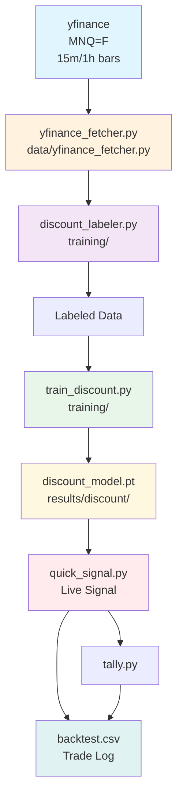
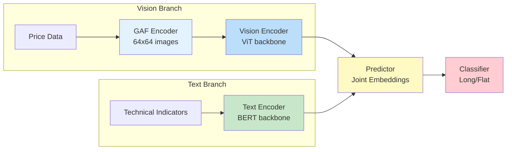

# MNQ Discount Signal System - Version 1

Binary trading signal system for Micro Nasdaq 100 (MNQ) futures using weekly 0.5 Fibonacci discount detection.

## Quick Start

```bash
# Install dependencies
pip install -r requirements.txt

# Fetch live data and get signal
python quick_signal.py

# Record trade (if signal is YES)
python tally.py
```

## Strategy

| Signal | Condition | Confidence |
|--------|-----------|------------|
| **YES** | Price < Weekly 0.5 Fib (Discount Zone) | 80% |
| **NO** | Price >= Weekly 0.5 Fib (Premium Zone) | 20% |

## Commands

| Command | Description |
|---------|-------------|
| `python quick_signal.py` | Get live binary signal |
| `python tally.py` | Record YES signal to backtest.csv |
| `python training/train_discount.py --data data/mnq_yfinance.csv --epochs 200 --batch 64 --yfinance` | Train discount model |

## Project Structure

```
MNQ-ME/
├── main.py                    # Main entry point
├── quick_signal.py            # Live signal generation
├── tally.py                   # Trade recording
├── requirements.txt           # Dependencies
├── config/
│   └── config.yaml            # Configuration
├── data/
│   ├── yfinance_fetcher.py    # Data pipeline
│   └── *_yfinance.csv         # OHLCV data
├── training/
│   ├── train_discount.py      # Model training
│   └── discount_labeler.py    # Labeling logic
├── models/
│   └── discount_detector.py   # Neural network model
└── results/
    ├── trained/               # Training results
    └── walkforward/           # Backtest results
```

## Data Source

- **Live Data**: Yahoo Finance (yfinance) - MNQ=F
- **Interval**: 1-hour bars for historical (8 months), 15-min for live
- **Correlation Assets**: ES, NQ, RTY, CL, GC, ZB, 6E

### Data Flow Codemap



| Stage | File | Input | Output |
|-------|------|-------|--------|
| Fetch | `data/yfinance_fetcher.py` | yfinance API | CSV files |
| Label | `training/discount_labeler.py` | CSV | Features + Labels |
| Train | `training/train_discount.py` | Labeled data | Model (.pt) |
| Signal | `quick_signal.py` | Live data | YES/NO signal |
| Track | `tally.py` | Signal | backtest.csv |

## JEPA Integration

The system includes optional VL-JEPA (Vision-Language Joint-Embedding Predictive Architecture) for advanced price action understanding.

### Architecture Overview



### Components

| Component | File | Description |
|-----------|------|-------------|
| GAF Encoder | `data/gaf_encoder.py` | Converts OHLC price series to Gramian Angular Field images |
| VL-JEPA Model | `models/vjepa_encoder.py` | Joint embedding vision-language model |
| SFT Trainer | `training/trainer.py` | Supervised fine-tuning pipeline |

### Features

- **GAF Encoding**: 64x64 Gramian Angular Summation Field images from 3-day price windows
- **Vision Transformer**: Pre-trained ImageNet weights for pattern recognition
- **BERT Text Encoder**: Embeds technical indicators and regime features
- **Joint Training**: Contrastive learning aligns vision and language representations

### Usage

```bash
# Pre-train JEPA on historical data
python main.py --mode train --phase jepa --data data/mnq_yfinance.csv

# Fine-tune for trading signals
python main.py --mode train --phase sft --data data/mnq_yfinance.csv
```

### Benefits

- Captures visual patterns in price action (head & shoulders, trends, consolidations)
- Learns semantic relationships between price patterns and market conditions
- Self-supervised pre-training reduces labeled data requirements
- Transfer learning from ImageNet improves generalization

## Sponsor

[MyCromwell.org](https://mycromwell.org) - Supporting quantitative trading research and development.

## License

Proprietary - For authorized use only.
# mnq-signal-cromwell
